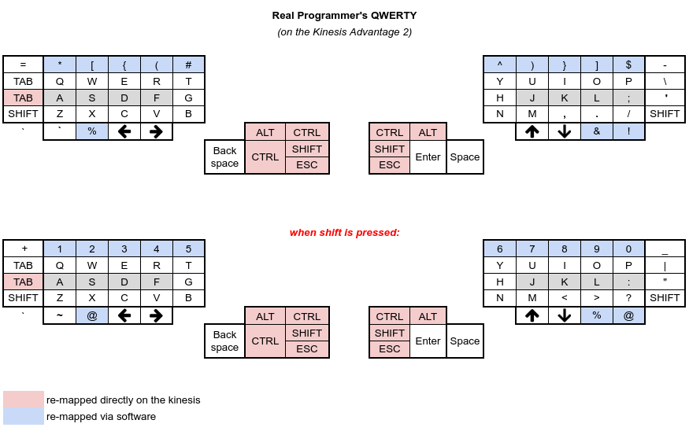

# Real Programmer's QWERTY

If you're in a hurry, go straight to [installing it](#installing-it).

# Motivation 

Inspired by ThePrimeagen's [Real Programmers Dvorak](https://github.com/ThePrimeagen/keyboards), I realized my QWERTY layout needs an update.

But let the harpoon man speak for himself:

> I type everyday of the week. For five of those seven days, i type for about 6-7 hours. It makes sense, removing my will for complacency, that i switch to a more efficient keyboard, if there is one. I present to you, Real Programmers Dvorak.

While I wouldn't go full dvorak myself, the rest of it makes perfect sense, especially after switching to a [Kinesis Advantage 2](https://kinesis-ergo.com/keyboards/advantage2-keyboard/) keyboard, where it's all about comfy programming now :-)!

## On German keyboard layouts and programming
But let's take a step back for now. While German is my mother tongue, I never really got the hang of German keyboard layouts. Growing up with a Commodore 128 home computer, I never liked having to trade brackets and braces for Umlauts that I would only ever use writing prose. So for the most time I stuck with an US keyboard layout, as I considered that far superior for programming. Having to press the alternate graphics (AltGr), shift, AND a number key for braces - who in their right mind would come up with this? On top of that, switching between DE and US keyboard layouts is pretty easy on modern computers - should the odd case come up that I need the Umlauts.

So clearly, the US keyboard layout had been an improvement already. But it took switching to the Advantage 2 keyboard, where the square brackets are located more inconveniently for my taste, to re-evaluate my options. As mentioned above, inspired by the real programmer's DVORAK layout, I started to think about how to optimize my QWERTY for programming.

## The idea of going full-programmer (keyboard layout)

In short:

1. Symmetrical symbol layout (parens, brackets, curlies)
2. Removing the need for SHIFT by putting numerical digits on the SHIFT row instead

The main idea for me was a good symbol layout with a symmetrical layout of opening and closing braces, brackets, and parentheses. That means, the finger used to close is the same finger on the other hand, like: left index finger for opening parens, right index finger for closing parens.

The second idea was having those symbols accessible without having to press the SHIFT key. Intuitively it made sense immediately that I type numbers far less frequently than I type those brackets, parens, and curly braces. Pressing SHIFT+1 instead of 1 is really not a big deal. 

## Implementing it
Since parens are already present on the number row, only four symbols have to be replaced to make space for brackets and curly braces. Regarding placement, all of the opening and closing symbols must be easily accessible for me. On my keyboard that means using the 2, 3, 4 and 7, 8, 9 keys which are reachable easily by extending my ring, middle, and index fingers.

So this boils down to the following mapping:

- 2 -> `[` 
- 3 -> `{`  
- 4 -> `(`
- 7 -> `)`
- 8 -> `}`
- 9 -> `]`

Eventually, I decided on which symbols to move off the number row:

- @ - goes right below the redundand key below the X (`\` / `|`) + SHIFT
- % - also goes below that redundand key, un-shifted
- & - goes where [ was
- ! - goes where ] was

This results in the following re-mapping of the top-row:

LEFT:
- <kbd>=</kbd> -> <kbd>=</kbd>
- <kbd>1</kbd> -> <kbd>*</kbd>
- <kbd>2</kbd> -> <kbd>[</kbd>
- <kbd>3</kbd> -> <kbd>{</kbd>
- <kbd>4</kbd> -> <kbd>(</kbd>
- <kbd>5</kbd> -> <kbd>#</kbd>

RIGHT:
- <kbd>6</kbd> -> <kbd>^</kbd>
- <kbd>7</kbd> -> <kbd>)</kbd>
- <kbd>8</kbd> -> <kbd>}</kbd>
- <kbd>9</kbd> -> <kbd>]</kbd>
- <kbd>0</kbd> -> <kbd>$</kbd>
- <kbd>-</kbd> -> <kbd>-</kbd>

Extra mappings:
- <kbd>\\</kbd> (below the X) -> <kbd>%</kbd>
- <kbd>|</kbd> (below the X) -> <kbd>@</kbd>
- <kbd>[</kbd> -> <kbd>&</kbd>
- <kbd>]</kbd> -> <kbd>!</kbd>

The numerical digits 0-9 are accessible by pressing the SHIFT key and the respective number key.

The reason behind `^` and `$` being where they are, is: in vim, `^` takes you to the beginning of a line and `$` takes you to the end. That makes these keys' new locations easy to remember.

# Installing it

These instructions have been tested on Ubuntu 20.04 LTS.

- clone this repository and cd into it
- link the layout into the right place: `sudo ln -s /usr/share/X11/xkb/real-prog-qerty real-prog-qwerty`
- activate the layout by `setxkbmap -layout real-prog-qwerty`
- revert it by invoking `setxkbmap -layout us` (provided you were using a US layout before)

If I am feeling funny, maybe one day I will look at ThePrimeagen's repo and check out how to do this on Windows. To be honest, though, optimizing for productivity AND using Windows doesn't strike me as a good combination.

## A note on i3
The best part of this is that I did not have to change my [i3 window manager](https://i3wm.org) config at all. i3 handles keyboard events directly, so $mod+SHIFT+1 keeps working as expected.

